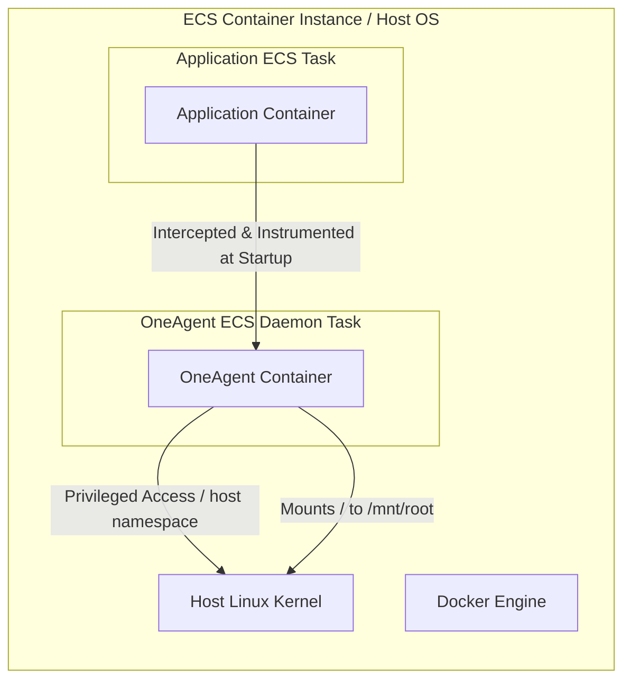
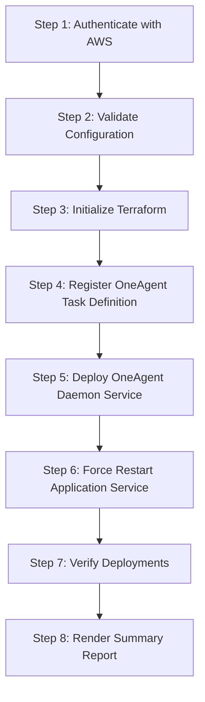

# Dynatrace OneAgent ECS Daemon Service Deployment

This repository provides a production-grade infrastructure-as-code solution using **Terraform** and **GitHub Actions** to deploy Dynatrace OneAgent as an ECS Daemon Service on Amazon ECS EC2 container instances. 

Following deployment, the pipeline triggers a rolling restart on your application ECS service to auto-inject monitoring and instrumentation.

---

## How It Works

To successfully monitor container traffic, system metrics, and application performance on AWS ECS, Dynatrace OneAgent runs at the host level rather than inside isolated application containers.



### 1. Host-Level Monitoring & Privileges
In the container definition configured in `terraform/main.tf`, the OneAgent requires specific permissions to access the underlying EC2 host:
* **Privileged Execution (`privileged = true`)**: Allows the OneAgent container to gain root-level administrative access on the host Linux kernel.
* **Host Namespaces (`network_mode = "host"`, `pid_mode = "host"`, `ipc_mode = "host"`)**:
  * `network_mode = "host"`: Bypasses virtual network bridges, letting OneAgent capture host and container network traffic directly.
  * `pid_mode = "host"`: Maps the container's process namespace directly to the host. OneAgent can inspect all running processes, including the processes of other containers on the EC2 host.
  * `ipc_mode = "host"`: Enables monitoring of inter-process communication on the host.
* **Root File System Mount (`/` to `/mnt/root`)**: Mounts the host's root directory into the OneAgent container as read-only. This allows the agent to inspect host configurations, logs, and container execution metrics.

### 2. Container Bootstrapping
When the OneAgent container starts, it downloads the lightweight OneAgent installer script via:
```text
${dynatrace_environment_url}/api/v1/deployment/installer/agent/unix/default/latest?arch=x86&flavor=default&Api-Token=${dynatrace_api_token}
```
The installer script runs inside the container, configures the local OS hook, and registers the EC2 instance with your Dynatrace tenant dashboard.

---

## ECS Daemon Scheduling Strategy

The ECS service uses:
```hcl
scheduling_strategy = "DAEMON"
```
* **One Task Per Host**: ECS ensures that exactly one instance of the OneAgent task runs on each EC2 container instance.
* **Auto-Scaling Compatibility**: When the Auto Scaling Group adds new EC2 instances to the ECS Cluster, ECS automatically schedules the OneAgent daemon task onto them. Conversely, when an instance scales down, ECS cleans up the daemon task automatically.

---

## Application Ingestion & Rolling Restart

Dynatrace monitors containers by dynamically injecting interceptor libraries into application runtimes at process startup. 
* **Startup Order Requirement**: For this instrumentation to occur, **OneAgent must be running on the host before the application processes spin up**.
* **Automatic Force Deployment**: Once the pipeline validates that the OneAgent daemon service has scaled and stabilizes on all instances, it executes a rolling restart:
  ```bash
  aws ecs update-service --cluster <cluster> --service <app> --force-new-deployment
  ```
This force-restarts all tasks of your application service. As new tasks start, they boot under active OneAgent monitoring, immediately starting APM telemetry flow.

---

## GitHub Actions 8-Step Pipeline

The single-job GHA workflow `Deploy to ECS` manages the setup in 8 structured, sequential steps:



1. **Step 1/8: Authenticate with AWS**: Configures the environment credentials using your credentials and confirms AWS CLI identity and region.
2. **Step 2/8: Validate Deployment Configuration**: Verifies the target ECS cluster and application service exist and are active, validating ARNs, tokens, and variables.
3. **Step 3/8: Initialize Terraform**: Initializes provider plugins and modules.
4. **Step 4/8: Register OneAgent Task Definition**: Uses Terraform target flags to build and register the task definition, exporting the generated ARN.
5. **Step 5/8: Deploy OneAgent Daemon Service**: Applies remaining resources and queries the cluster instance count, waiting until running tasks match the registered instance count.
6. **Step 6/8: Restart Application Service**: Forces a rolling update on the application service and blocks until ECS indicates it is stable.
7. **Step 7/8: Verify Deployment**: Checks the active status of both services and counts task instances.
8. **Step 8/8: Deployment Summary**: Generates a success or failure status report containing AWS details, service status, and task revisions.

---

## Configuration & Usage

For directory structure details, environment variables, GitHub Secrets configuration, and local usage commands, please see the [Terraform Configuration README](file:///Users/yashhedaoo/Desktop/PR/tf_ecs_update/terraform/README.md).
